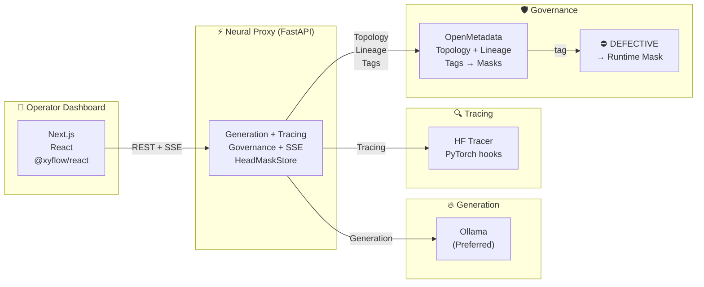
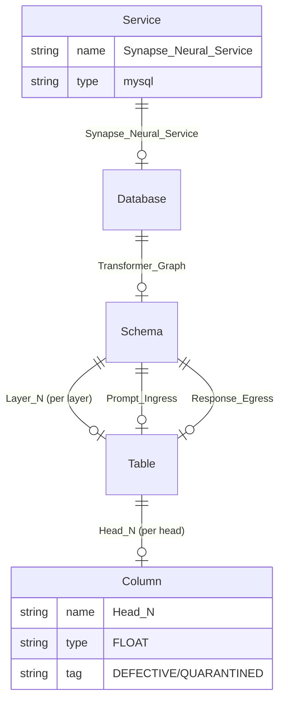
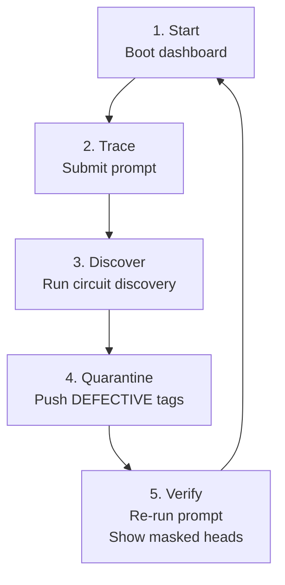

# Synapse-Graph (AI Autopsy Engine)

<div align="center">

**Turn LLM internals into observable, governable infrastructure**

[](https://fiscalmindset.github.io/Synapse-Graph/)
[](https://youtu.be/idOJYh6TUC8)
[](https://youtu.be/b78Y7RwvYeU)

</div>

---

## Live Presentation

**HTML Presentation** — [Open in browser](https://fiscalmindset.github.io/Synapse-Graph/first_frame.html)

| Scene | Description |
|-------|-------------|
| [Intro](https://fiscalmindset.github.io/Synapse-Graph/first_frame.html) | Project overview, features, graph visualization |
| [Architecture (Interactive)](https://fiscalmindset.github.io/Synapse-Graph/architecture.html) | Clickable component diagram |
| [Tech Stack](https://fiscalmindset.github.io/Synapse-Graph/tech_stack.html) | Dependencies |
| [Demo](https://fiscalmindset.github.io/Synapse-Graph/video_scene.html) | Demo video |
| [OpenMetadata](https://fiscalmindset.github.io/Synapse-Graph/openmetadata_usage.html) | Governance plane |
| [Status](https://fiscalmindset.github.io/Synapse-Graph/project_status.html) | Capabilities + gaps |
| [Thank You](https://fiscalmindset.github.io/Synapse-Graph/last_frame.html) | Credits |

## Video Demos

- **[Complete Demo Walkthrough](https://youtu.be/idOJYh6TUC8)** — 2-3 min circuit discovery → quarantine → re-run
- **[Product Demo](https://youtu.be/b78Y7RwvYeU)** — Live run showing active heads, lineage, quarantine

---

<div style="background: linear-gradient(135deg, rgba(96,212,255,0.08), rgba(62,225,255,0.05)); border: 1px solid rgba(96,212,255,0.25); border-radius: 12px; padding: 32px 24px; margin: 24px 0; backdrop-filter: blur(10px); box-shadow: 0 8px 24px rgba(96,212,255,0.08);">

## 💡 The Motivation: Breaking the Black Box

The idea for Synapse-Graph came from a deep frustration with current AI observability tools. Today, if an LLM hallucinates or goes off-script, developers only have two terrible options:

<div style="display: grid; grid-template-columns: 1fr 1fr; gap: 16px; margin: 20px 0;">

<div style="background: rgba(15,25,45,0.6); border-left: 3px solid #60d4ff; border-radius: 8px; padding: 16px; backdrop-filter: blur(10px);">
<strong style="color: #60d4ff;">❌ Prompt Engineering</strong>
<div style="color: #a0b0c8; font-size: 0.95em; margin-top: 8px;">Begging the AI to behave in the system prompt</div>
</div>

<div style="background: rgba(15,25,45,0.6); border-left: 3px solid #ff6b6b; border-radius: 8px; padding: 16px; backdrop-filter: blur(10px);">
<strong style="color: #ff6b6b;">💸 Retraining/Fine-tuning</strong>
<div style="color: #a0b0c8; font-size: 0.95em; margin-top: 8px;">Spending thousands of dollars on compute</div>
</div>

</div>

Current observability platforms (like LangSmith or Arize) only look at the *surface*—prompts, tokens, and latency. They treat the AI like a **black box**. I wanted to build a tool that treats the AI like an **engine**. 

<div style="background: rgba(62,225,255,0.1); border: 1px solid rgba(96,212,255,0.3); border-radius: 10px; padding: 16px; margin: 20px 0; color: #e6eef8;">
<strong style="color: #3ee1ff;">🔧 The Core Insight:</strong> If a spark plug misfires, you don't replace the whole car; you find the <span style="color: #60d4ff; font-weight: 600;">exact spark plug</span> and fix it.
</div>

I realized that if we could apply **Mechanistic Interpretability** (finding the exact neural circuits causing a behavior) and tie it to **Enterprise Data Governance** (OpenMetadata), we could **fix hallucinations in real-time, at zero cost, without retraining**.

</div>

---

<div style="background: linear-gradient(135deg, rgba(57,255,20,0.08), rgba(96,212,255,0.05)); border: 1px solid rgba(57,255,20,0.25); border-radius: 12px; padding: 32px 24px; margin: 24px 0; backdrop-filter: blur(10px); box-shadow: 0 8px 24px rgba(57,255,20,0.08);">

## ⚙️ Engineering Philosophy: How It Actually Works

To achieve live neural surgery, Synapse-Graph abandons standard API wrappers and operates directly on the model's tensors. We solved this using a **three-part engineering architecture**:

<div style="display: grid; grid-template-columns: 1fr; gap: 16px; margin: 24px 0;">

<div style="background: linear-gradient(135deg, rgba(96,212,255,0.1), rgba(62,225,255,0.05)); border: 1px solid rgba(96,212,255,0.3); border-radius: 10px; padding: 20px; backdrop-filter: blur(10px); transition: all 0.3s ease;">

### 🔍 Part 1: The PyTorch Shadow Tracer (The Telemetry)

Instead of just reading the final output, we inject `register_forward_hook` directly into the attention modules of the loaded Hugging Face model. As the generation runs, we **extract the exact multi-dimensional attention activations** (Layer-by-Layer, Head-by-Head) **without slowing down the inference**.

<div style="background: rgba(0,0,0,0.3); border-left: 3px solid #3ee1ff; border-radius: 6px; padding: 12px; margin-top: 12px; font-family: 'Courier New', monospace; font-size: 0.9em; color: #60d4ff;">
Hook captures: Attention weights + Projection output → Zero overhead
</div>

</div>

<div style="background: linear-gradient(135deg, rgba(57,255,20,0.1), rgba(96,212,255,0.05)); border: 1px solid rgba(57,255,20,0.3); border-radius: 10px; padding: 20px; backdrop-filter: blur(10px); transition: all 0.3s ease;">

### 🛡️ Part 2: The OpenMetadata Hack (The Governance)

AI neural networks don't fit into standard data catalogs. We engineered a **synthetic topology mapper** that translates a live neural network into a SQL database format:

<div style="background: rgba(0,0,0,0.3); border-radius: 8px; padding: 16px; margin-top: 12px;">

<table style="width: 100%; color: #e6eef8; border-collapse: collapse;">
<tr style="border-bottom: 1px solid rgba(57,255,20,0.2);">
<td style="padding: 8px 12px; font-weight: 600; color: #60d4ff;">Model</td>
<td style="padding: 8px 12px;">→ Database</td>
</tr>
<tr style="border-bottom: 1px solid rgba(57,255,20,0.2);">
<td style="padding: 8px 12px; font-weight: 600; color: #60d4ff;">Transformer Layers</td>
<td style="padding: 8px 12px;">→ Tables</td>
</tr>
<tr>
<td style="padding: 8px 12px; font-weight: 600; color: #60d4ff;">Attention Heads</td>
<td style="padding: 8px 12px;">→ Columns</td>
</tr>
</table>

</div>

This allows us to track **"Thought Lineage"** as standard data lineage edges, and use enterprise tagging to flag specific neurons.

</div>

<div style="background: linear-gradient(135deg, rgba(255,107,107,0.1), rgba(255,137,137,0.05)); border: 1px solid rgba(255,107,107,0.3); border-radius: 10px; padding: 20px; backdrop-filter: blur(10px); transition: all 0.3s ease;">

### ⚡ Part 3: Causal Ablation (The Surgery)

**Correlation is not causation.** To prove a specific head is causing a hallucination, our backend runs an automated **$O(n^2)$ Ablation Sweep**:

1. Systematically **zero out suspect heads** (multiply their projection matrices by `0.0`)
2. Measure the **drop in hallucination probability**
3. Once the causal head is found, tag it as `⛔ DEFECTIVE` in OpenMetadata
4. Our FastAPI proxy **permanently masks it** on all future runs

<div style="background: rgba(0,0,0,0.3); border-left: 3px solid #ff6b6b; border-radius: 6px; padding: 12px; margin-top: 12px; font-family: 'Courier New', monospace; font-size: 0.9em; color: #ff8787;">
Cost: $0 (no retraining) | Time: Minutes | Precision: Exact neural circuit
</div>

</div>

</div>

</div>

---

## The Problem

LLMs are powerful but opaque. Current observability stops at prompts, tokens, latency, and logs. They don't answer:

- *Which layers and heads were most active for this response?*
- *Can we trace a "thought path" through the network?*
- *Can governance tools intervene on specific neural components?*

## The Solution

Synapse-Graph repurposes **OpenMetadata** as a governance and lineage system for transformer internals:

- Model → **Database**
- Transformer layers → **Tables**
- Attention heads → **Columns**
- High-activation paths → **Lineage edges**
- `DEFECTIVE` tag → **Runtime control signal** that masks a head during next generation

## The Impact

Turns model internals into **inspectable infrastructure** with familiar data-platform primitives.

---

## Architecture



**Interactive diagram:** [Click here for full interactive architecture](https://fiscalmindset.github.io/Synapse-Graph/architecture.html)

---

## Backend Details

### `backend/app/main.py` — FastAPI Application

**REST Endpoints:**
| Endpoint | Method | Purpose |
|----------|--------|---------|
| `/api/v1/state` | GET | Current runtime state |
| `/api/v1/generate` | POST | Full generation response |
| `/api/v1/generate/stream` | POST | SSE with trace steps |
| `/api/v1/autopsy/discover_circuit` | POST | Circuit discovery |
| `/api/v1/autopsy/discover_circuit/stream` | POST | SSE discovery progress |
| `/api/v1/autopsy/causal` | POST | Causal autopsy |
| `/api/v1/openmetadata/bootstrap` | POST | Bootstrap catalog |
| `/api/v1/openmetadata/sync-defects` | POST | Sync tags to masks |
| `/api/v1/openmetadata/quarantine` | POST | Quarantine heads |
| `/api/v1/webhooks/openmetadata` | POST | Webhook handler |
| `/api/v1/governance/local-mask` | POST | Set head mask |
| `/api/v1/governance/clear-local-masks` | POST | Clear masks |
| `/api/v1/hf/preload` | POST | Load HF tracer |

**Execution Modes:**
- `AUTO` — Prefer Ollama if available
- `FAST` — Ollama + parallel HF tracing
- `FAITHFUL` — Only HF with inline tracing

**Hook-Based Attention Capture:**
```python
def _register_attention_hooks(model, layer_idx, hook_handles):
    # Registers register_forward_hook on attention modules
    # Captures: attention_weights, projection output
    
def _make_projection_mask_hook(layer_idx, head_idx):
    # Applies masking to output projection
    # Zeroes masked head's hidden states
```

**Two-Level Masking:**
1. Attention tensor masking
2. Projection masking (hidden states)

**Default Models:**
- Ollama: `qwen2.5:3b-instruct`
- HuggingFace: `Qwen/Qwen2.5-1.5B-Instruct`
- Dashboard default: `gpt2` (12 layers × 12 heads = 144 heads)

---

## OpenMetadata Topology



**Classification & Tags:**
- Classification: `SynapseQuarantine`
- Tag: `DEFECTIVE` (color: #39FF14)

**Lineage:** `Prompt_Ingress → Layer_1 → ... → Layer_N → Response_Egress`

---

## Frontend Details

### Dashboard Components

- **`frontend/components/synapse-dashboard.tsx`** — Main dashboard with metrics, discovery panel, governance controls
- **`frontend/components/synapse-graph.tsx`** — @xyflow/react graph visualization
- **`frontend/components/activation-chart.tsx`** — Per-layer, per-head activation charts
- **`frontend/components/console-log.tsx`** — Real-time log stream display

### Dashboard Features

**Metric Cards:**
- Generation Backend (Ollama live / HF inline)
- Trace Fidelity (Exact / Proxy evidence)
- Lineage Depth (active hops)
- Masked Heads count

**Causal Discovery Panel:**
- Target token input (hallucination to remove)
- `top_k_heads` slider (1-20)
- `max_pair_sweeps` slider (0-190)
- Run Discovery → View Overlay → Quarantine buttons

**Governance Panel:**
- Quarantine Top Head
- Clear Local Masks
- Sync Defects button

---

## Tech Stack

### Backend (`backend/pyproject.toml`)
```toml
[project]
requires-python = ">=3.11,<3.13"

dependencies = [
    "fastapi>=0.115.0",
    "torch>=2.4.0",
    "transformers>=4.46.0",
    "openmetadata-ingestion>=1.12.0",
    "httpx>=0.28.0",
    "pydantic-settings>=2.7.0",
    "uvicorn[standard]>=0.32.0",
    "accelerate>=1.1.0",
    "cachetools>=5.3.0",
]
```

### Frontend (`frontend/package.json`)
```json
{
  "dependencies": {
    "next": "^15.2.0",
    "react": "^19.0.0",
    "@xyflow/react": "^12.4.4",
    "recharts": "^2.15.0",
    "lucide-react": "^0.468.0"
  },
  "devDependencies": {
    "tailwindcss": "^3.4.16",
    "typescript": "^5.7.2"
  }
}
```

---

## Quickstart

```bash
# Backend
python3.11 -m venv .venv && source .venv/bin/activate
pip install -e ./backend
cp backend/.env.example backend/.env
cd backend && python -m uvicorn app.main:app --reload --port 8000

# Frontend (new terminal)
cd frontend && npm install && npm run dev
```

Dashboard: `http://localhost:3000`

---

## Demo Workflow



1. **Start** — Boot dashboard, verify "Ollama live" or "HF fallback"
2. **Trace** — Submit prompt → watch synapse graph light up
3. **Discover** — Enter hallucination token → run circuit discovery
4. **Quarantine** — Click "Quarantine" → push DEFECTIVE tags to OpenMetadata
5. **Verify** — Re-run prompt → show masked heads count increase

---

## Repository Layout

```
Synapse-Graph/
├── backend/
│   ├── app/
│   │   ├── main.py          # FastAPI + endpoints
│   │   ├── inference.py     # Generation + tracing
│   │   └── om_client.py    # OpenMetadata client
│   └── tests/
│       ├── test_quarantine.py
│       └── test_discover_quarantine_integration.py
├── frontend/
│   ├── app/                 # Next.js app router
│   ├── components/         # Dashboard, graph, charts
│   └── lib/               # API client
├── architecture.html       # Interactive architecture diagram
└── first_frame.html        # GitHub Pages presentation
```

---

## License

MIT

---

## Connect

<p align="center">
  
</p>

<h3 align="center">Vicky Kumar</h3>
<p align="center" style="color:#6b8aad;font-size:14px;">algsoch</p>

<p align="center">
  <a href="https://www.linkedin.com/in/algsoch">
    
  </a>
  <a href="https://www.github.com/algsoch">
    
  </a>
  <a href="https://www.github.com/fiscalmindset">
    
  </a>
</p>

<p align="center">
  <a href="mailto:npdimagine@gmail.com">npdimagine@gmail.com</a> · 
  <a href="tel:+918383848219">+91 8383848219</a>
</p>

<p align="center">
  <strong>Project:</strong> 
  <a href="https://github.com/FiscalMindset/Synapse-Graph">GitHub Repo</a> · 
  <a href="https://fiscalmindset.github.io/Synapse-Graph/">Live Demo</a> · 
  <a href="https://youtu.be/idOJYh6TUC8">YouTube Demo</a>
</p>

<p align="center">
  <em>Built for AI Interpretability</em>
</p>