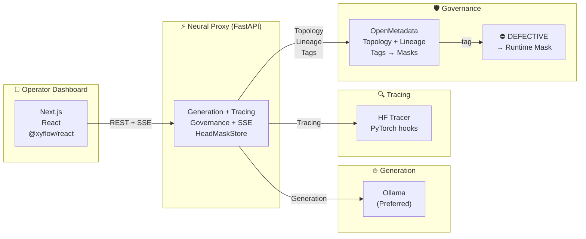
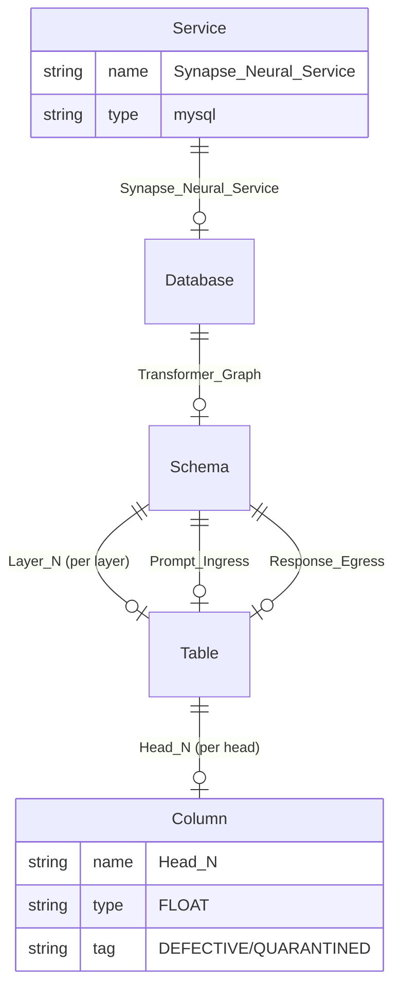
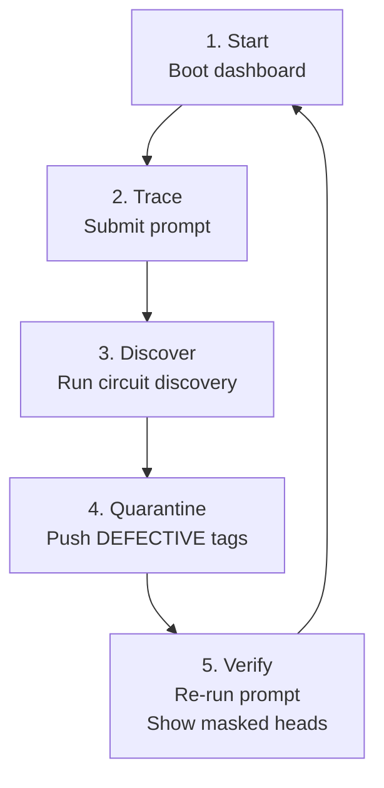

# Synapse-Graph (AI Autopsy Engine)

<div align="center">

**Turn LLM internals into observable, governable infrastructure**

[](https://fiscalmindset.github.io/Synapse-Graph/)
[](https://youtu.be/idOJYh6TUC8)
[](https://youtu.be/b78Y7RwvYeU)

</div>

---

## Live Presentation

**HTML Presentation** — [Open in browser](https://fiscalmindset.github.io/Synapse-Graph/first_frame.html)

| Scene | Description |
|-------|-------------|
| [Intro](https://fiscalmindset.github.io/Synapse-Graph/first_frame.html) | Project overview, features, graph visualization |
| [Architecture (Interactive)](https://fiscalmindset.github.io/Synapse-Graph/architecture.html) | Clickable component diagram |
| [Tech Stack](https://fiscalmindset.github.io/Synapse-Graph/tech_stack.html) | Dependencies |
| [Demo](https://fiscalmindset.github.io/Synapse-Graph/video_scene.html) | Demo video |
| [OpenMetadata](https://fiscalmindset.github.io/Synapse-Graph/openmetadata_usage.html) | Governance plane |
| [Status](https://fiscalmindset.github.io/Synapse-Graph/project_status.html) | Capabilities + gaps |
| [Thank You](https://fiscalmindset.github.io/Synapse-Graph/last_frame.html) | Credits |

## Video Demos

- **[Complete Demo Walkthrough](https://youtu.be/idOJYh6TUC8)** — 2-3 min circuit discovery → quarantine → re-run
- **[Product Demo](https://youtu.be/b78Y7RwvYeU)** — Live run showing active heads, lineage, quarantine

---

## The Problem

LLMs are powerful but opaque. Current observability stops at prompts, tokens, latency, and logs. They don't answer:

- *Which layers and heads were most active for this response?*
- *Can we trace a "thought path" through the network?*
- *Can governance tools intervene on specific neural components?*

## The Solution

Synapse-Graph repurposes **OpenMetadata** as a governance and lineage system for transformer internals:

- Model → **Database**
- Transformer layers → **Tables**
- Attention heads → **Columns**
- High-activation paths → **Lineage edges**
- `DEFECTIVE` tag → **Runtime control signal** that masks a head during next generation

## The Impact

Turns model internals into **inspectable infrastructure** with familiar data-platform primitives.

---

## Architecture



**Interactive diagram:** [Click here for full interactive architecture](https://fiscalmindset.github.io/Synapse-Graph/architecture.html)

---

## Backend Details

### `backend/app/main.py` — FastAPI Application

**REST Endpoints:**
| Endpoint | Method | Purpose |
|----------|--------|---------|
| `/api/v1/state` | GET | Current runtime state |
| `/api/v1/generate` | POST | Full generation response |
| `/api/v1/generate/stream` | POST | SSE with trace steps |
| `/api/v1/autopsy/discover_circuit` | POST | Circuit discovery |
| `/api/v1/autopsy/discover_circuit/stream` | POST | SSE discovery progress |
| `/api/v1/autopsy/causal` | POST | Causal autopsy |
| `/api/v1/openmetadata/bootstrap` | POST | Bootstrap catalog |
| `/api/v1/openmetadata/sync-defects` | POST | Sync tags to masks |
| `/api/v1/openmetadata/quarantine` | POST | Quarantine heads |
| `/api/v1/webhooks/openmetadata` | POST | Webhook handler |
| `/api/v1/governance/local-mask` | POST | Set head mask |
| `/api/v1/governance/clear-local-masks` | POST | Clear masks |
| `/api/v1/hf/preload` | POST | Load HF tracer |

**Execution Modes:**
- `AUTO` — Prefer Ollama if available
- `FAST` — Ollama + parallel HF tracing
- `FAITHFUL` — Only HF with inline tracing

**Hook-Based Attention Capture:**
```python
def _register_attention_hooks(model, layer_idx, hook_handles):
    # Registers register_forward_hook on attention modules
    # Captures: attention_weights, projection output
    
def _make_projection_mask_hook(layer_idx, head_idx):
    # Applies masking to output projection
    # Zeroes masked head's hidden states
```

**Two-Level Masking:**
1. Attention tensor masking
2. Projection masking (hidden states)

**Default Models:**
- Ollama: `qwen2.5:3b-instruct`
- HuggingFace: `Qwen/Qwen2.5-1.5B-Instruct`
- Dashboard default: `gpt2` (12 layers × 12 heads = 144 heads)

---

## OpenMetadata Topology



**Classification & Tags:**
- Classification: `SynapseQuarantine`
- Tag: `DEFECTIVE` (color: #39FF14)

**Lineage:** `Prompt_Ingress → Layer_1 → ... → Layer_N → Response_Egress`

---

## Frontend Details

### Dashboard Components

- **`frontend/components/synapse-dashboard.tsx`** — Main dashboard with metrics, discovery panel, governance controls
- **`frontend/components/synapse-graph.tsx`** — @xyflow/react graph visualization
- **`frontend/components/activation-chart.tsx`** — Per-layer, per-head activation charts
- **`frontend/components/console-log.tsx`** — Real-time log stream display

### Dashboard Features

**Metric Cards:**
- Generation Backend (Ollama live / HF inline)
- Trace Fidelity (Exact / Proxy evidence)
- Lineage Depth (active hops)
- Masked Heads count

**Causal Discovery Panel:**
- Target token input (hallucination to remove)
- `top_k_heads` slider (1-20)
- `max_pair_sweeps` slider (0-190)
- Run Discovery → View Overlay → Quarantine buttons

**Governance Panel:**
- Quarantine Top Head
- Clear Local Masks
- Sync Defects button

---

## Tech Stack

### Backend (`backend/pyproject.toml`)
```toml
[project]
requires-python = ">=3.11,<3.13"

dependencies = [
    "fastapi>=0.115.0",
    "torch>=2.4.0",
    "transformers>=4.46.0",
    "openmetadata-ingestion>=1.12.0",
    "httpx>=0.28.0",
    "pydantic-settings>=2.7.0",
    "uvicorn[standard]>=0.32.0",
    "accelerate>=1.1.0",
    "cachetools>=5.3.0",
]
```

### Frontend (`frontend/package.json`)
```json
{
  "dependencies": {
    "next": "^15.2.0",
    "react": "^19.0.0",
    "@xyflow/react": "^12.4.4",
    "recharts": "^2.15.0",
    "lucide-react": "^0.468.0"
  },
  "devDependencies": {
    "tailwindcss": "^3.4.16",
    "typescript": "^5.7.2"
  }
}
```

---

## Quickstart

```bash
# Backend
python3.11 -m venv .venv && source .venv/bin/activate
pip install -e ./backend
cp backend/.env.example backend/.env
cd backend && python -m uvicorn app.main:app --reload --port 8000

# Frontend (new terminal)
cd frontend && npm install && npm run dev
```

Dashboard: `http://localhost:3000`

---

## Demo Workflow



1. **Start** — Boot dashboard, verify "Ollama live" or "HF fallback"
2. **Trace** — Submit prompt → watch synapse graph light up
3. **Discover** — Enter hallucination token → run circuit discovery
4. **Quarantine** — Click "Quarantine" → push DEFECTIVE tags to OpenMetadata
5. **Verify** — Re-run prompt → show masked heads count increase

---

## Repository Layout

```
Synapse-Graph/
├── backend/
│   ├── app/
│   │   ├── main.py          # FastAPI + endpoints
│   │   ├── inference.py     # Generation + tracing
│   │   └── om_client.py    # OpenMetadata client
│   └── tests/
│       ├── test_quarantine.py
│       └── test_discover_quarantine_integration.py
├── frontend/
│   ├── app/                 # Next.js app router
│   ├── components/         # Dashboard, graph, charts
│   └── lib/               # API client
├── architecture.html       # Interactive architecture diagram
└── first_frame.html        # GitHub Pages presentation
```

---

## License

MIT