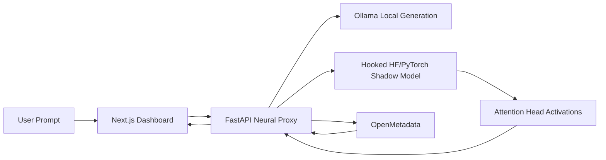

# Synapse-Graph

**Synapse-Graph** is an "LLM Glassbox" for local models. It turns a running transformer into a governed lineage graph by capturing live attention-head activity, translating that activity into OpenMetadata entities, and letting operators quarantine defective heads from a metadata control plane.

This project is built as a full-stack system:

- A **FastAPI neural proxy** sits between the user, a local LLM, and OpenMetadata.
- A **PyTorch/Hugging Face shadow tracer** hooks attention modules and extracts per-layer, per-head activations in real time.
- A **Next.js dashboard** visualizes the active neural path, streaming outputs, masked heads, and OpenMetadata sync state.

## Why This Project Exists

### The problem

LLMs are operationally powerful but structurally opaque. Most developer tools stop at prompts, tokens, latency, and logs. They do not answer questions like:

- Which layers and heads were most active for this response?
- Can we trace a "thought path" through the network in a way operators can inspect?
- Can governance tools intervene on specific neural components instead of only blocking whole prompts or outputs?

### The solution

Synapse-Graph repurposes **OpenMetadata** as a governance and lineage system for transformer internals:

- The model becomes a synthetic **database**.
- Each transformer layer becomes a **table**.
- Each attention head becomes a **column**.
- High-activation paths become **lineage edges**.
- A metadata tag like `DEFECTIVE` becomes an operational control signal that masks a head during the next generation.

### The impact

This turns model internals into something teams can observe, govern, and discuss with familiar data-platform primitives. Instead of treating neural behavior as black-box magic, Synapse-Graph makes it inspectable infrastructure.

## What Makes It Novel

- It treats **mechanistic interpretability data** as metadata assets, not just research artifacts.
- It bridges a **local generation engine** like Ollama with a parallel **hook-instrumented PyTorch tracer**.
- It closes the loop between **governance** and **runtime control** by letting OpenMetadata tags modify future generations.
- It frames model debugging using concepts data teams already understand: schemas, lineage, classifications, and tags.

## How Clearly The Project Should Be Presented

If this is being judged on presentation quality, the README, demo, and submission should all communicate the same three things immediately:

### 1. Problem

Local LLMs are powerful but opaque. Teams lack a way to inspect internal activity or govern specific neural components in real time.

### 2. Solution

Synapse-Graph maps transformer layers and heads into OpenMetadata, captures live attention activity with PyTorch hooks, and visualizes active lineage in a premium operator dashboard.

### 3. Impact

The system gives developers a practical way to inspect, audit, and intervene on model behavior using tools and governance patterns they already know.

For a strong submission, make sure the demo and write-up answer:

- **What is broken today?** LLM observability is mostly surface-level.
- **What did we build?** A neural proxy plus lineage visualizer plus metadata-driven firewall.
- **Why does it matter?** It makes local models more understandable, governable, and safer to operate.
- **What is the proof?** A live run showing active heads, OpenMetadata lineage, and a tagged head being masked on the next generation.

## Demo Narrative

Use this sequence for a clean 2-3 minute hackathon demo:

1. Start with the thesis: "We hijacked OpenMetadata to map the internal neural architecture of a local LLM in real time."
2. Show the dashboard and send a prompt through the local model.
3. Point out that Ollama handles the primary generation while the PyTorch tracer captures per-head attention activity in parallel.
4. Show the active lineage path lighting up in the graph as tokens stream back.
5. Open the OpenMetadata side and tag a head or layer as `DEFECTIVE`.
6. Trigger the defect sync endpoint or use the dashboard sync control.
7. Run the same or a similar prompt again and show that the tagged head is now masked during generation.
8. Close with the impact: "This turns model interpretability into an operational control plane, not just a static visualization."

## Architecture



## Core Capabilities

- **Local-first generation**: Prefers Ollama when `http://127.0.0.1:11434` is available.
- **Mechanistic tracing**: Uses `register_forward_hook` to capture attention-head activity from a Hugging Face model.
- **Metadata translation**: Creates OpenMetadata entities for the model, layers, and heads.
- **Dynamic lineage**: Emits lineage edges for high-activation paths during generation.
- **Neural quarantine**: Applies `DEFECTIVE` OpenMetadata tags as live head masks for future generations.
- **Operator dashboard**: Streams completions, shows activation charts, and renders the synapse graph in real time.

## Repository Layout

- `backend/`: FastAPI service, inference engine, OpenMetadata integration, lineage ingestion, and head masking.
- `frontend/`: Next.js dashboard, React Flow synapse visualizer, Recharts activation panels, and SSE client.

## Backend Overview

The backend has three main responsibilities:

### 1. Inference and tracing

[`backend/app/inference.py`](backend/app/inference.py)

- Detects whether Ollama is available.
- Uses Ollama as the primary generator when possible.
- Loads a hook-instrumented Hugging Face model for topology discovery and attention capture.
- Tracks masked heads and applies zeroing before attention outputs are projected.

### 2. Metadata translation

[`backend/app/om_client.py`](backend/app/om_client.py)

- Creates synthetic OpenMetadata services, databases, schemas, tables, and columns.
- Maps layers to tables and heads to columns.
- Sends lineage edges representing the active neural route.
- Polls OpenMetadata tags and converts `DEFECTIVE` annotations into head masks.

### 3. Runtime orchestration

[`backend/app/main.py`](backend/app/main.py)

- Exposes REST and SSE endpoints for state, generation, OpenMetadata sync, and HF preload.
- Keeps the latest session snapshot available for the frontend.
- Synchronizes defect tags before generation and ingests lineage asynchronously.

## Frontend Overview

The dashboard is designed as a premium operator console rather than a generic AI chat app.

Key UI surfaces:

- [`frontend/components/synapse-dashboard.tsx`](frontend/components/synapse-dashboard.tsx): main dashboard shell, prompt console, logs, and metrics.
- [`frontend/components/synapse-graph.tsx`](frontend/components/synapse-graph.tsx): vertical transformer graph with highlighted lineage edges.
- [`frontend/components/activation-chart.tsx`](frontend/components/activation-chart.tsx): layer and head activation charts.
- [`frontend/lib/api.ts`](frontend/lib/api.ts): state fetch, defect sync, HF preload, and streaming generation client.

## Quickstart

### Prerequisites

- Python `3.11` or `3.12`
- Node.js `20+`
- `npm`
- Optional but recommended: local Ollama at `http://127.0.0.1:11434`
- Optional but recommended: OpenMetadata at `http://127.0.0.1:8585`

### 1. Backend setup

From the repository root:

```bash
python3.11 -m venv .venv
source .venv/bin/activate
python -m ensurepip --upgrade
python -m pip install --upgrade pip setuptools wheel
python -m pip install -e ./backend
cp backend/.env.example backend/.env
```

If you prefer Python `3.12`, replace `python3.11` with `python3.12`.

### 2. Run the backend

```bash
cd backend
python -m uvicorn app.main:app --reload --port 8000
```

Use `python -m uvicorn`, not bare `uvicorn`, so the active virtual environment is always used.

### 3. Frontend setup

In a second terminal:

```bash
cd frontend
cp .env.local.example .env.local
npm install
npm run dev
```

The frontend defaults to `http://127.0.0.1:8000` for the backend. Override it with `NEXT_PUBLIC_NEURAL_PROXY_URL` in `frontend/.env.local` if needed.

## Environment Configuration

### Backend

Copy:

```bash
cp backend/.env.example backend/.env
```

Common variables:

- `SYNAPSE_OPENMETADATA_ENABLED`
- `SYNAPSE_OPENMETADATA_HOST`
- `SYNAPSE_OPENMETADATA_JWT_TOKEN`
- `SYNAPSE_OLLAMA_MODEL`
- `SYNAPSE_HF_MODEL_NAME`
- `SYNAPSE_PRELOAD_SHADOW_MODEL`

Authentication for private Hugging Face models

- `SYNAPSE_HF_TOKEN`: Optional. If the configured `SYNAPSE_HF_MODEL_NAME` points to a private or gated HF repo, set this to a valid HF Hub token so the backend can download the tokenizer and model weights. The server also honors common env vars `HF_HUB_TOKEN`, `HUGGINGFACE_HUB_TOKEN`, and `HF_TOKEN`.
- Alternatively, authenticate locally with the Hugging Face CLI:

```bash
pip install huggingface-hub
huggingface-cli login
```

Notes:

- If you intend to use a local Ollama model (for example `phi3:latest`), set `SYNAPSE_OLLAMA_MODEL` and prefer Ollama for generation. Using an Ollama-style identifier in `SYNAPSE_HF_MODEL_NAME` may result in attempted HF lookups; the runtime now heuristically skips HF loading for simple colon-style identifiers and will log guidance.
- To force the HF tracer to load (useful after setting an auth token), call the `/api/v1/hf/preload` endpoint or set `SYNAPSE_PRELOAD_SHADOW_MODEL=true` before startup.

### Frontend

Copy:

```bash
cp frontend/.env.local.example frontend/.env.local
```

Key variable:

- `NEXT_PUBLIC_NEURAL_PROXY_URL`

## How To Test Whether The Idea Works

This project should be tested as a sequence of observable proofs, not just "does the app boot."

### Test 1. Local generation is live

- Start the backend and frontend.
- Open the dashboard.
- Confirm the backend reports `Ollama live` if Ollama is running, otherwise `HF fallback`.
- Submit a prompt and verify text streams back.

### Test 2. Neural tracing is live

- Watch the synapse graph during generation.
- Confirm lineage edges light up as trace steps arrive.
- Verify the activation panel updates with per-layer and per-head activity.

### Test 3. OpenMetadata translation works

- Call the backend bootstrap or state endpoints.
- Verify that OpenMetadata contains:
  - one synthetic database for the model
  - one schema for the transformer graph
  - one table per layer
  - one column per head

### Test 4. Dynamic lineage ingestion works

- Run a prompt through the system.
- Inspect OpenMetadata lineage and verify prompt-to-layer-to-response relationships were created.

### Test 5. Governance actually changes runtime behavior

- Tag a layer or head in OpenMetadata as `DEFECTIVE`.
- Trigger a sync from the dashboard or call the sync endpoint.
- Run another prompt.
- Verify the masked head count increases and the next generation runs with that head zeroed out.

If all five tests pass, the idea is not just "interesting on paper" but working as an end-to-end system.

## Useful Endpoints

- `GET /health`
- `GET /api/v1/state`
- `POST /api/v1/openmetadata/bootstrap`
- `POST /api/v1/openmetadata/sync-defects`
- `POST /api/v1/hf/preload`
- `POST /api/v1/generate`
- `POST /api/v1/generate/stream`

## Example Demo Prompt

Use a prompt that makes the interpretability story easy to explain:

```text
Trace the attention route you would use to explain why masking a single head can change a model's response.
```

## Known Runtime Notes

- The backend is pinned to Python `<3.13` because PyTorch and parts of the OpenMetadata stack are more reliable on Python `3.11` and `3.12`.
- Ollama is preferred for user-facing generation, but the Hugging Face tracer may still need to load on first run to populate the neural topology.
- The first Hugging Face model load can take time if weights are not already present locally.
