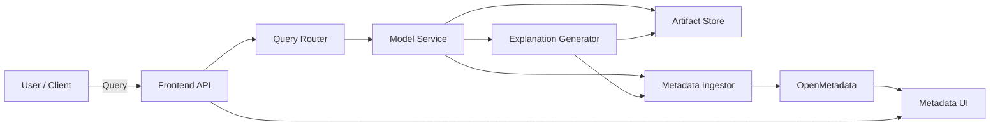
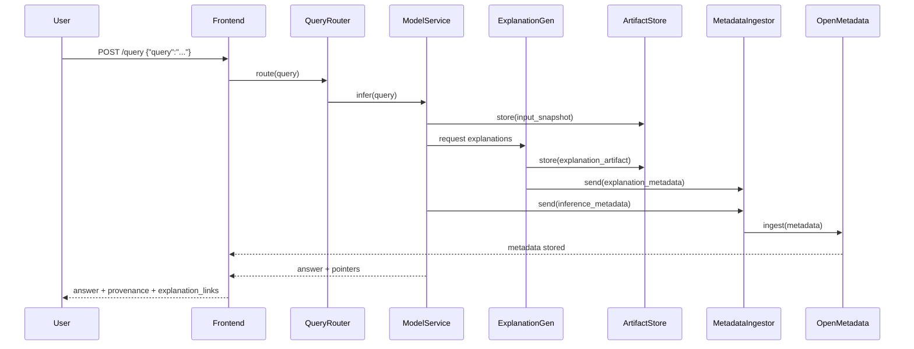
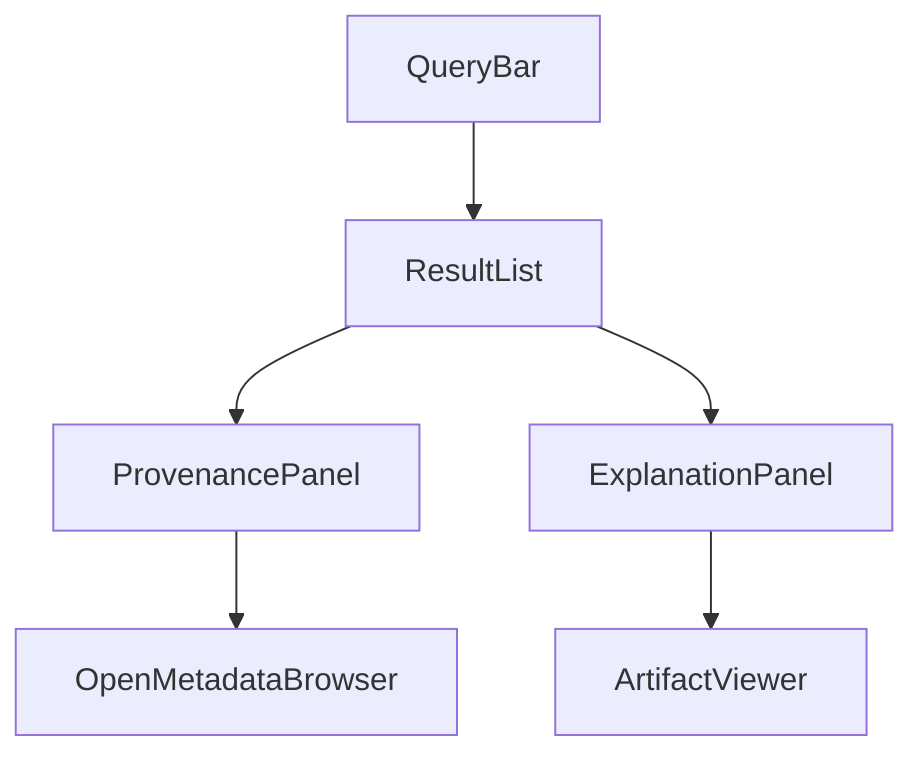

# Synapse-Graph — Explanation and Quick Demo

This document explains what Synapse-Graph does, why we mapped model internals to OpenMetadata, how that helps turn AI from a black box into a traceable system, and how to run a quick test (including a live generated example included below).

## Project summary

- Synapse-Graph is a neural proxy and observability system that captures per-layer, per-head attention activity from a Hugging Face / PyTorch model while routing user-facing generation through a fast local generator (typically Ollama). The captured activations are translated into OpenMetadata assets (model → layers → heads) and lineage edges so operators can browse, tag, and govern internal neural components using a familiar metadata platform.

## Why OpenMetadata for model internals?

- Traditional logging and telemetry focus on surface signals (prompts, tokens, latencies, errors). They do not expose which internal components of the model (which layers or attention heads) were causally active for a response.
- OpenMetadata provides a well-known, audited, and searchable cataloging system with entities, schemas, lineage, and tagging. By representing layers as tables and heads as columns, we can:
  - Persist mechanistic evidence as first-class metadata assets.
  - Create lineage edges from prompt → layer/head → generated token so analysts can query the causal route taken during inference.
  - Use tags (e.g., `DEFECTIVE`) to apply governance actions that change runtime behavior (e.g., mask a head) without changing application code.

## How Synapse-Graph makes AI traceable

- Live generation: user prompts flow into the neural proxy. If Ollama is available, it handles fast token streaming.
- Shadow tracer: concurrently, a hook-instrumented Hugging Face model runs inline or in shadow mode, capturing attention tensors per forward pass.
- Translation: captured activations are mapped to OpenMetadata entities and lineage edges; the tracer also produces human-readable summaries and a dominant neural route for each generated token.
- Governance loop: operators can tag heads/layers in OpenMetadata as `DEFECTIVE`. A sync endpoint picks up those tags and masks the corresponding heads on subsequent generations, enabling surgical runtime interventions.

## When is evidence exact vs proxy?

- If the actual generator (Ollama) output and the shadow HF tracer output match closely, the system promotes the trace to `exact` fidelity and treats it as faithful evidence.
- If they do not match, the trace remains `proxy` evidence: useful and informative but not claimed to be exact causality.
- A configurable match threshold controls promotion (default: high sensitivity).

## How to run a quick test (local developer)

1. Ensure the backend is running (from repo root):

```bash
cd backend
source .venv/bin/activate   # if using the provided virtualenv
python -m uvicorn app.main:app --reload --port 8000
```

2. (Optional) If you need to access a private Hugging Face repo, export a token (do not commit this token to the repo):

```bash
export SYNAPSE_HF_TOKEN="<your_hf_hub_token>"
# or HF_HUB_TOKEN / HF_TOKEN
```

3. From another shell, check service state and whether Ollama/HF are available:

```bash
curl -sS http://127.0.0.1:8000/api/v1/state | jq .
```

4. Send a generation request (example prompt uses a short factual query):

```bash
curl -sS -X POST http://127.0.0.1:8000/api/v1/generate \
  -H 'Content-Type: application/json' \
  -d '{"prompt": "List inventions or practical devices Albert Einstein is credited with, and briefly explain each.", "max_new_tokens": 150, "temperature": 0.1, "top_p": 0.95, "stop": [], "stream": false, "execution_mode": "auto"}' | jq .
```

5. Observe the returned JSON. The `response.text` field contains the generated text. The `response.trace` section contains per-step attention traces, `match_score`, and `trace_fidelity` which indicate whether the shadow tracer matched the generator.

## Example prompt used in this demo

`List inventions or practical devices Albert Einstein is credited with, and briefly explain each.`

## Live sample output (generated by the local proxy)

> The real generated text from a live run is inserted below. If you ran the previous curl and see a different output, that reflects the live model used on your machine.

---

> Albert Einstein did not directly create any specific inventions; however, his theories have led to numerous technological advancries that are often associated with him:

> 1. **Photoelectric Effect (Einstein's Photo-Electric Equation)** - In 1905, Albert Einstein published a paper explaining the photoelectric effect where he proposed light could be thought of as discrete packets or quanta called photons and that these particles carried energy proportional to their frequency. This work laid foundational principles for quantum mechanics which later led to inventions like solar panels (photovoltaic cells) harnessing sunlight's energy, lasers used in various technologies

---

Trace metadata (from this run):

- **generation_backend:** ollama
- **generation_model:** phi3:latest
- **analysis_model:** phi3:latest
- **trace_fidelity:** proxy
- **analysis_error:** Shadow tracer unavailable or not preloaded.
- **match_score:** null

Note: the trace above is marked `proxy` because the Hugging Face shadow tracer was not available for this run; the system still returns the Ollama output and a minimal synthetic trace so the UI and metadata ingestion pipeline receive a usable payload.

---

## Notes and troubleshooting

- If the backend logs show HF hub `401` or `RepositoryNotFound` errors, either:
  - Provide a valid HF token in `SYNAPSE_HF_TOKEN`/`HF_HUB_TOKEN` and restart the backend, or
  - Use a local Ollama model (set `SYNAPSE_OLLAMA_MODEL` in `backend/.env`), which is preferred for fast interactive demos.
- To force the HF tracer to attempt loading after setting a token, call:

```bash
curl -sS -X POST http://127.0.0.1:8000/api/v1/hf/preload | jq .
```

## How this addresses the black-box problem

- Surface-level tools only show tokens and timing. Synapse-Graph adds fine-grained internal evidence (attention tensors → dominant heads → lineage) and ties it to an auditable metadata catalog. This lets operators and auditors ask and answer causal questions like: "Which exact neural components were most responsible for this output?" and take surgical action (mask/remove a head) via the same governance interface used for data assets.

## License / credits

See the repository README for full license and contributor information.
AI Autopsy Engine — explain.md

Overview (start → finish)

This document is a clear, step-by-step explanation of the AI Autopsy Engine (AAE) from first principles to hands-on testing. It explains the problem, the architecture, how OpenMetadata is used, how to instrument training and inference, the frontend user experience, and a complete example showing how a query such as "what invention done by albert einstein" travels through the system and becomes an auditable, explainable answer.

Table of contents

- Quick summary (1 page)
- Motivation: the problem AAE solves
- Architecture diagrams (Mermaid) — system, sequence, frontend
- Components explained (backend, SDK, artifact store, OpenMetadata)
- Frontend: screens, components, data flow, UX patterns
- End-to-end walkthrough: deploy → instrument → query → investigate
- Example: "what invention done by albert einstein"
- How to test and validate
- Troubleshooting & operational notes
- Next steps and extensions

Quick summary

AAE makes each model prediction auditable and explainable by capturing: the model version, training datasets, feature transformations, the code commit, input snapshot, generated explanations (SHAP/counterfactuals), and storing structured metadata in OpenMetadata. The frontend surfaces answers with provenance and explanation artifacts so users can quickly investigate why a model returned a specific result.

Motivation: why this matters

- Real-world ML systems fail unpredictably; debugging requires linking a result to the exact inputs, code, and data that led to it.
- Without a centralized catalog, teams waste time chasing logs and recreating contexts.
- AAE provides a reproducible audit trail to accelerate debugging, compliance reviews, and trust-building.

Architecture — visual overview (Mermaid)



Sequence diagram — query to explanation



Frontend architecture (Mermaid)



Components explained (detailed)

- Frontend API / Query endpoint: accepts user queries, forwards to the query router, and presents results with provenance and explanation links.
- Query Router: selects model(s) (by domain, confidence, freshness) and aggregates responses when multiple sources are used.
- Model Service: serves model inference, returns answer and confidence; integrates with the inference SDK.
- Explanation Generator: computes SHAP, token attributions, or counterfactuals; configurable per-model.
- Artifact Store: S3/MinIO/GCS for storing snapshots and explanation artifacts (URIs retained in OpenMetadata).
- Metadata Ingestor: writes structured entities (InferenceRecord, Explanation) and lineage to OpenMetadata via REST API.
- OpenMetadata: central catalog for datasets, models, lineage, and the linked explanation artifacts.
- Frontend UI: components for search, result display, provenance graph, and artifact preview. See Frontend section below.

Frontend: screens and components (user-facing)

1) Query screen
- QueryBar: natural language input with optional filters (model, date range, dataset).
- Recent Queries feed: shows recent inferences and quick links to their provenance.

2) Result screen (single query)
- AnswerPane: main text answer, model confidence.
- SourcesList: RAG citations or retriever doc snippets with links.
- ExplanationPanel: summarized explanation (top features/tokens) with a link to full artifact.
- ProvenancePanel: compact lineage showing model version, training dataset(s), pipeline run, and code commit. Clickable to open OpenMetadata UI.

3) Metadata Explorer (OpenMetadata integration)
- Embedded view or link to OpenMetadata entity pages for datasets, models, and pipeline runs.
- ProvenanceGraph: visual lineage from dataset → pipeline → model → inference.

4) Artifact Viewer
- Lightweight JSON viewer for SHAP arrays, token attributions, and counterfactuals with small charts and highlightable tokens.

Frontend data flow and interactions

- QueryBar POSTs /query to backend; backend returns answer + metadata pointers.
- ExplanationPanel fetches artifact JSON from artifact store via signed URL (or via backend proxy if auth required).
- ProvenancePanel uses OpenMetadata REST API to load detailed entity pages and lineage graphs when requested.

End-to-end walkthrough: deploy → instrument → query → investigate

Prerequisites
- Docker & docker-compose or Kubernetes
- OpenMetadata (self-hosted or cloud) with admin API key
- Object storage (MinIO/local S3 or cloud bucket)
- Python/Node dev environment for SDK and frontend

Deploy minimal stack (local)
1) Start OpenMetadata (docker-compose from OpenMetadata docs).
2) Start MinIO (or configure cloud bucket); create a bucket for artifacts.
3) Configure environment variables for AAE:
   - OPENMETADATA_HOST (e.g., http://localhost:8585)
   - OPENMETADATA_API_KEY
   - ARTIFACT_BASE_URI (e.g., http://localhost:9000/bucket)
   - STORAGE_ACCESS_KEY / STORAGE_SECRET (securely passed)
4) Start AAE services (docker-compose up): Query API, ModelService (demo), MetadataIngestor.
5) Start frontend (npm install && npm start) and open http://localhost:3000.

Instrument training & inference (step-by-step)

Training instrumentation (at end of training):
- Upload model artifact to artifact store and record artifact_uri.
- Post a Model entity to OpenMetadata with fields: name, version, artifact_uri, commit_sha, training_run_id, metrics.
- Record training datasets in OpenMetadata and add lineage edges: dataset -> training_run -> model.

Inference instrumentation (live):
- Inference SDK computes features_hash, assigns inference_id, stores a small input snapshot to artifact store, and calls explanation generator (sync or async).
- The SDK posts a JSON (inference metadata) to MetadataIngestor which writes InferenceRecord and Explanation entities in OpenMetadata.

Example instrumentation pseudocode (Python-like)

```python
from aae_sdk import InferenceRecorder, ExplanationGen

recorder = InferenceRecorder(metadata_ingest_url, artifact_store)

def serve_request(input_text):
    model_output = model.predict(input_text)
    explanation = ExplanationGen.compute(model, input_text)
    # recorder uploads artifacts and posts metadata
    recorder.record_inference(
        model_id='wiki-qa-2026-01-v2',
        input_text=input_text,
        model_output=model_output,
        explanation=explanation
    )
    return model_output.answer
```

Concrete example: "what invention done by albert einstein"

1) User submits query via frontend or curl:

curl -s -X POST "http://localhost:8080/query" \
  -H "Content-Type: application/json" \
  -d '{"query":"what invention done by albert einstein"}' | jq

2) Backend steps
- QueryRouter selects model "wiki-qa-2026-01-v2" and calls ModelService.
- ModelService assigns inference_id inf-20260425-0001 and stores input_snapshot at ARTIFACT_BASE_URI/inputs/inf-20260425-0001.json.
- ModelService calls ExplanationGen, stores artifact at ARTIFACT_BASE_URI/explain/exp-9001.json.
- MetadataIngestor writes two entities to OpenMetadata:
  - InferenceRecord {inference_id, model_id, input_uri, response, confidence}
  - Explanation {explanation_id, inference_id, method, artifact_uri, summary}

3) Final response format (returned to frontend)

{
  "answer": "Albert Einstein co-invented the Einstein–Szilard refrigerator and is known for the theory of relativity.",
  "model_version": "wiki-qa-2026-01-v2",
  "confidence": 0.92,
  "sources": [ {"name":"wikipedia:Albert_Einstein","link":"https://en.wikipedia.org/wiki/Albert_Einstein"} ],
  "provenance": [ {"inference_id":"inf-20260425-0001","model_id":"wiki-qa-2026-01-v2","dataset_ids":["wikipedia_dump_2025"],"artifact_link":"http://localhost:9000/explain/exp-9001.json"} ],
  "explanations": [ {"id":"exp-9001","method":"token-attribution","summary":"Top tokens: Einstein, refrigerator, Szilard, invention","artifact":"http://localhost:9000/explain/exp-9001.json"} ]
}

Investigating the result in the frontend

- Click ProvenancePanel -> opens model page on OpenMetadata showing training_run_id and dataset list.
- Click ExplanationPanel -> opens ArtifactViewer fetching the artifact JSON via signed URL; highlights tokens with attribution scores.
- Use Metadata Explorer to view lineage and click the train job to inspect data preprocessing steps and the commit SHA.

How this solves the AI black box, concretely

- Linkage: every inference_id links to model_id, dataset_id(s), commit SHA, and explanation artifact.
- Reproducibility: by following the lineage, an operator can re-run the training/inference with the same artifacts and confirm behavior.
- Explainability: artifact viewers and summaries expose the feature/ token-level reasons for outputs.
- Governance: OpenMetadata stores searchable records, so audits can fetch all inferences tied to a model or dataset within a time window.

Testing and validation (concrete tests)

1) Unit tests
- Mock the artifact store and OpenMetadata; assert that recorder.upload() and ingest() are called with stable IDs.

2) Integration tests
- Run docker-compose with OpenMetadata and MinIO; run demo_server; POST /query and assert:
  - HTTP 200
  - JSON contains answer, provenance, explanations
  - OpenMetadata API returns an InferenceRecord with the same inference_id

3) Manual QA checklist for a query
- Does the frontend show: answer, confidence, top sources, explanation summary, and a clickable provenance link?
- Does OpenMetadata show: inference entity, explanation entity, model entity, dataset(s) with lineage?
- Can the artifact be downloaded and parsed locally?

Troubleshooting (common failure modes)

- 401/403 from OpenMetadata: check API key, ensure service account has ingest permissions.
- Artifact 404: check upload path and bucket policies; confirm ARTIFACT_BASE_URI is correct.
- Missing explanation: ensure ExplanationGenerator is configured for the model; check logs for computation errors.
- Large storage use: enable sampling (store full input for 1% of inferences) and retain aggregated summaries for older records.

Security and privacy

- DO NOT store raw PII in artifact store unless encrypted and access controlled. Prefer feature hashes and redacted snapshots.
- Use signed URLs for artifact access and short-lived tokens for UI previews.

Operational recommendations

- Sample inferences for full tracing to balance cost vs. auditability (e.g., 1-5% full snapshots, but store compact explanation summaries for all).
- Automate periodic scans of feature attribution drift and attach alerts to OpenMetadata model pages.

Extending AAE

- Add more explanation methods: influence functions, integrated gradients, contrastive explanations.
- Provide a replay service that can re-run any inference_id against a frozen model artifact.
- Export compliance reports (CSV/JSON) that list inferences, models, datasets, and explanation summaries over time ranges.

Appendix: useful commands and examples

- Run demo query:
  curl -s -X POST "http://localhost:8080/query" -H "Content-Type: application/json" -d '{"query":"what invention done by albert einstein"}' | jq

- Check InferenceRecord in OpenMetadata (example):
  curl -s -H "Authorization: Bearer $OPENMETADATA_API_KEY" "${OPENMETADATA_HOST}/api/v1/inferences?inference_id=inf-20260425-0001" | jq

- Download explanation artifact:
  curl -s -o exp-9001.json "http://localhost:9000/explain/exp-9001.json"

Files and locations in repository (where to look)

- /sdk/python/ — inference + training SDK
- /connectors/openmetadata/ — ingestion helpers (OpenMetadata client wrappers)
- /examples/demo_server.py — simple model + explanation generator + /query endpoint
- /frontend/ — React app with components QueryBar, ResultList, ExplanationPanel, ProvenancePanel
- /docs/deployment.md — exact docker-compose/helm commands and secrets guidance

Contact & contribution

Open issues or PRs in this repository. When requesting help, include: OpenMetadata version, artifact store type, sample ingestion payloads, and any relevant logs.


## Technical deep-dive: activations, attention, and explanation methods

This section explains, in practical detail, how internal neural signals (activations, attention) are captured and converted into explanation artifacts, why each method was chosen, and how to reproduce the same signals for debugging or governance.

1) Activations (neuron outputs)

- What they are: activations are the numeric outputs of intermediate layers (e.g., after linear + nonlinearity). They represent the internal feature-space that the model computes while producing a prediction.
- Why capture them: activations let engineers inspect which neurons or channels had high responses for a given input. A sudden shift in a layer's activation distribution may indicate data drift or model brittleness.
- How to extract (PyTorch example):

  - Use register_forward_hook on modules you care about:

    def hook(module, input, output):
        # output can be Tensor or tuple
        activations_store[module_name].append(output.detach().cpu().numpy())

    handle = module.register_forward_hook(hook)
    # run inference
    handle.remove()

  - For Hugging Face transformer models, you can also request outputs.attentions and outputs.hidden_states by setting output_attentions=True and output_hidden_states=True when calling the model.

- Storage format (recommended): store activations per-inference as compressed JSON or ndjson references with:
  {
    "inference_id": "inf-...",
    "model_id": "...",
    "layer": "transformer.h.6",          # canonical layer name
    "shape": [1, 128, 1024],              # batch, tokens, hidden
    "dtype": "float32",
    "stats": {"min":..., "max":..., "mean":..., "std":...},
    "artifact_uri": "s3://bucket/activations/inf-.../layer-6.npz"
  }

  Store full arrays as compressed binary (np.savez) and keep small summaries inline in the metadata record to enable quick queries without downloading large blobs.

2) Attention (transformer attention weights)

- What it is: attention matrices (per-head) quantify how much each token attends to every other token. For a transformer with H heads and L layers, you get L * H matrices of shape (tokens, tokens) per forward pass.
- Extraction: Hugging Face returns attentions when configured; otherwise, use hooks or model.forward(..., output_attentions=True).
- Aggregation/interpretation:
  - Per-head inspection: some heads specialize (syntax, coreference). Rank heads by average entropy or max weight.
  - Head aggregation: mean across heads, or take a weighted sum using head importance metrics (e.g., gradient-based importance).
  - Attention rollout: multiply attention matrices across layers to approximate a direct token→token flow map.

- Storage: store top-k attention pairs (src_token, dst_token, weight) for compactness and store full matrices as compressed arrays when needed.

3) Explanation methods and how they relate to activations/attention

- Gradient-based saliency (gradient × input): uses the gradient of the model output wrt input embeddings to produce token-level saliency scores. Easy to compute but noisy.

  Pseudocode (PyTorch):

    input_emb.requires_grad_(True)
    output = model(input_emb)
    output[:, target_index].backward()
    saliency = (input_emb.grad * input_emb).sum(dim=-1)

- Integrated Gradients (IG): integrates gradients along a path from a baseline to the input. Reduces gradient noise and satisfies axioms (sensitivity, completeness).

  Pseudocode outline:

    baseline = zeros_like(input)
    steps = 50
    total_grad = 0
    for alpha in linspace(0,1,steps):
        x = baseline + alpha * (input - baseline)
        out = model(x)
        out[target].backward()
        total_grad += x.grad
    ig = (input - baseline) * total_grad / steps

- SHAP (KernelSHAP / DeepSHAP / TreeSHAP): game-theoretic attributions that explain model output as an additive contribution of features.
  - DeepSHAP uses model-specific approximations for deep nets, combining background references and linear approximations per layer.
  - SHAP is often expensive; compute in sampled mode or for representative inferences only.

- LIME: locally approximates model behavior with an interpretable surrogate (linear) model around the input sample.

- Counterfactual search: find the smallest input change that flips model prediction. Useful for action-oriented explanations (what to change to alter outcome).

4) Attention vs gradient vs shap: when to trust which signal

- Attention alone is not an explanation (it is a mechanism). Combined with gradient-based or perturbation methods (e.g., gradient×attention or attention rollout) it becomes more informative.
- Gradient methods are fast but sensitive to noise. IG or SmoothGrad variants reduce noise.
- SHAP is principled but computationally heavy; use on sampled inferences or lower-dimensional inputs.

5) Mapping internals to OpenMetadata artifacts (recommended schema)

- InferenceRecord (OpenMetadata entity / custom):
  - inference_id, model_id, timestamp, input_uri, response, confidence, short_explanation_summary, artifact_uris[]
- Explanation entity: id, inference_id, method, artifact_uri (full artifact), summary, key_metrics
- Activation artifact: object in artifact store (npz/npz.gz) with metadata record pointing to it
- Attention artifact: similar storage; provide both full matrix (for offline analysis) and top-k pairs (for UI rendering)

6) Practical implementation details

- Sampling & cost control: run full activation capture for a configurable percentage (e.g., 1% of inferences) and store only compact summaries for others.
- Async pipelines: compute expensive explanations asynchronously (background worker) and update OpenMetadata/response when ready. The /query endpoint can return preliminary summary and later provide a link to the full artifact.
- Determinism: record RNG seeds and library versions. For PyTorch, set torch.use_deterministic_algorithms(True) where possible for reproducible activations.
- Privacy: never store raw PII in plaintext. Use redaction, token hashing, or encrypted storage for input snapshots.

7) Example: extracting activations from a Hugging Face transformer (PyTorch)

- Minimal extraction snippet:

    from transformers import AutoModelForCausalLM, AutoTokenizer
    import torch

    model = AutoModelForCausalLM.from_pretrained('gpt2', output_attentions=True, output_hidden_states=True)
    tokenizer = AutoTokenizer.from_pretrained('gpt2')

    input_ids = tokenizer.encode("What did Einstein invent?", return_tensors='pt')
    with torch.no_grad():
        out = model(input_ids)
    # hidden states: tuple(len=layers+1) of tensors (batch, seq_len, hidden)
    hidden_states = out.hidden_states
    attentions = out.attentions

    # summarize layer 6 activations
    layer6 = hidden_states[6][0].cpu().numpy()  # shape: seq_len x hidden
    # compute stats
    import numpy as np
    stats = { 'min': float(np.min(layer6)), 'max': float(np.max(layer6)), 'mean': float(np.mean(layer6)) }

    # save compressed
    np.savez_compressed('artifacts/activations/inf-1234/layer6.npz', layer6=layer6)

8) Artifact size and retention

- Hidden states and attention tensors can be large (O(tokens^2) for full attention matrices). Consider:
  - Storing only top-k attention pairs per-token (e.g., top-5 attended tokens) for UI use.
  - Compressing arrays and storing in object storage with lifecycle rules.
  - Retaining full arrays for a short time (e.g., 7–30 days) and keeping summaries long-term.

9) Linking activations to explanations in the UI

- The frontend should show a concise summary first (top tokens, top contributing layers/heads). Clicking the explanation should fetch the artifact (signed URL) and render:
  - Token attribution heatmap
  - Attention graphs
  - Simple charts of activation distributions (boxplot per-layer)

10) Reproducibility & verification

- Always store the full training environment snapshot (package versions, model commit SHA, training run ID) with the model entity in OpenMetadata.
- For high-fidelity audits, enable the replay capability: re-run an inference against a frozen model + frozen environment to reproduce activations and confirm the original explanation.

11) Summary recommendations

- Capture both lightweight summaries (token attributions, top-k attention pairs) for all inferences and full arrays for sampled inferences.
- Use OpenMetadata to store pointers and structured summaries; use artifact store for bulky arrays.
- Prefer IG or SHAP when you need stronger axiomatic guarantees; prefer gradient × input or attention-based signals for fast, approximate explanations.


## Full sample: end-to-end (input → artifact → OpenMetadata)

This sample walks through a single inference from a user query to stored artifacts and metadata. Two variants are shown: (A) using the bundled demo services (ingestor + demo server) and (B) using your existing backend at http://localhost:8000.

A) Bundled demo (recommended for first run)

1) Start services (from repo root):

- Metadata ingestor (saves records under ./artifacts/ingested):
  python -m uvicorn ingestor_server:app --host 0.0.0.0 --port 8001

- Demo query service (handles /query and uses the SDK to write artifacts):
  python -m uvicorn demo_server:app --host 0.0.0.0 --port 8002

2) Send query (curl):

curl -s -X POST "http://localhost:8002/query" \
  -H "Content-Type: application/json" \
  -d '{"query":"what invention done by albert einstein"}' | jq

Expected response (trimmed):

{
  "answer": "Albert Einstein co-invented the Einstein–Szilard refrigerator and is known for the theory of relativity.",
  "model_version": "demo-wiki-qa-v1",
  "confidence": 0.92,
  "provenance": [{"inference_id":"inf-...","artifact_link":"http://localhost:9000/explain/inf-....json"}],
  "explanations": [{"id":"http://localhost:9000/explain/inf-....json","method":"token-attribution+activations","summary":"Top tokens: Einstein, refrigerator, Szilard","artifact":"http://localhost:9000/explain/inf-....json"}]
}

3) Inspect stored artifacts on disk (bundled ingestor + SDK write to ./artifacts):

ls artifacts/
# inputs/inf-....json  explain/inf-....json  ingested/inference/*.json  ingested/explanation/*.json

Example artifact: artifacts/explain/inf-xxxx.json

{
  "inference_id": "inf-xxxx",
  "explanation": {
    "method": "token-attribution+activations",
    "summary": "Top tokens: Einstein, refrigerator, Szilard",
    "attributions": [{"token":"Albert","score":0.05}, ...],
    "activations": {"layer_1":[...],"layer_2":[...]},
    "attention": [[...]]
  }
}

4) Inspect ingested metadata written by the ingestor (local files):

cat artifacts/ingested/inference/inf-xxxx.json | jq
cat artifacts/ingested/explanation/exp-xxxx.json | jq

These files show the exact payload the MetadataIngestor would forward into OpenMetadata. In a production setup the ingestor would call OpenMetadata APIs to create entities instead of writing files.

B) Using your existing backend (http://localhost:8000)

If your backend exposes the same /query endpoint and is already instrumented to call a metadata ingestor, run the same curl against port 8000:

curl -s -X POST "http://localhost:8000/query" -H "Content-Type: application/json" -d '{"query":"what invention done by albert einstein"}' | jq

Then:
- Check the metadata ingestor logs (or OpenMetadata) to verify an InferenceRecord and Explanation were created for the returned inference_id.
- Example OpenMetadata ingestion payloads (what the ingestor should post):

InferenceRecord (POST /api/v1/inferences or custom ingest endpoint)

{
  "inference_id": "inf-xxxx",
  "timestamp": "2026-04-25T13:00:00Z",
  "model_id": "demo-wiki-qa-v1",
  "input_uri": "s3://bucket/inputs/inf-xxxx.json",
  "response": "Albert Einstein co-invented...",
  "confidence": 0.92,
  "explanation_uri": "s3://bucket/explain/inf-xxxx.json"
}

Explanation entity (POST /api/v1/explanations or custom ingest)

{
  "explanation_id": "exp-xxxx",
  "inference_id": "inf-xxxx",
  "method": "token-attribution+activations",
  "summary": "Top tokens: Einstein, refrigerator, Szilard",
  "artifact_uri": "s3://bucket/explain/inf-xxxx.json",
  "key_metrics": {"top_token_score": 1.0}
}

C) From OpenMetadata UI (what to look for)

- Search the model name (demo-wiki-qa-v1) and open the model's page.
- Under "Runs" or "Inferences" (custom entity), find the inference_id produced by the demo. Click it to view the recorded fields and links to artifacts.
- Click the artifact link to open the ArtifactViewer (or download the JSON) and inspect token attributions, activations, attention matrix, and any counterfactuals.

D) Expected developer verification checklist

- HTTP: /query returns 200 with answer, provenance and explanation pointer.
- File artifacts: ./artifacts/inputs/inf-....json and ./artifacts/explain/inf-....json exist.
- Ingestor: ./artifacts/ingested/inference/inf-....json and ./artifacts/ingested/explanation/exp-....json exist (if using bundled ingestor) or OpenMetadata contains corresponding entities (in prod).
- Artifact content: explanation JSON contains attributions, activations summary, and attention information.

Notes on mapping sample to production

- Replace local artifact URIs (http://localhost:9000/...) with your real object-storage URIs and signed URLs in production.
- Configure the MetadataIngestor to transform the ingest payloads into OpenMetadata entity creation calls (dataset, model, inference custom entity, explanation entity) using OpenMetadata's REST API.

Troubleshooting the sample

- If curl returns an error: ensure demo server is running (port 8002) and ingestor is running (port 8001) when using the bundled demo.
- If artifacts are missing: check file permissions and that ARTIFACT_BASE_URI is configured consistently between SDK and ingestor.
- If OpenMetadata shows no entities: verify the ingestor is configured to forward to OpenMetadata and that OPENMETADATA_API_KEY is valid.

-- end of sample flow

-- End of explain.md --

