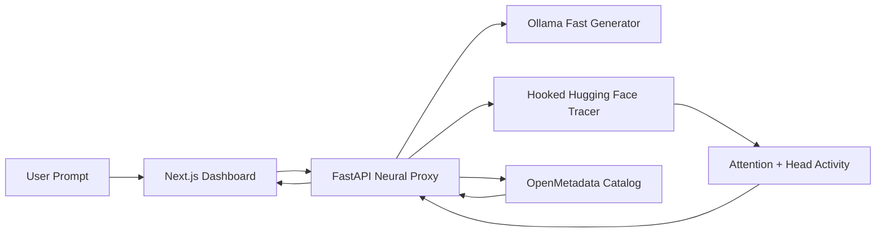

# AI Autopsy Engine / Synapse-Graph Explanation

## Short Answer

AI Autopsy Engine attacks the AI black-box problem by turning each model run into an auditable record: prompt, model identity, traced internal activity, generated output, OpenMetadata lineage, and governance actions. The strongest part of the current solution is the live transformer tracing path: attention layers and heads are captured from a hooked Hugging Face model, mapped into OpenMetadata as model -> layer -> head assets, and rendered in the dashboard as a neural lineage route.

The main gap is also important: attention activity is evidence, not complete causal proof. A head receiving high attention does not automatically mean it caused the final answer. The improved implementation now marks every trace with explicit `evidence_quality`, `black_box_gaps`, and recommended next actions so the product does not overclaim. Exact tracing, shadow tracing, ablation, replay, provenance, and governance are separated clearly.

## What Problem It Solves

Most AI observability tools show surface behavior:

- Prompt and response text.
- Latency, errors, and token counts.
- Sometimes retrieval sources or confidence scores.

Those signals do not answer deeper operational questions:

- Which model version produced this answer?
- Which prompt tokens were most influential?
- Which internal layers and attention heads were active?
- Was this evidence captured from the same model run, or from a proxy tracer?
- Can an operator isolate a suspicious neural component and verify the effect?
- Can an auditor inspect the decision path later?

AI Autopsy Engine is built to make those questions answerable through trace capture, metadata lineage, and controlled intervention.

## Current Architecture



Core files:

- `backend/app/inference.py`: generation, Hugging Face hooks, attention capture, trace fidelity, evidence quality, and head masking.
- `backend/app/main.py`: FastAPI endpoints, streaming, session state, OpenMetadata sync, and lineage ingestion scheduling.
- `backend/app/om_client.py`: OpenMetadata mapping, synthetic model/layer/head assets, lineage edges, and `DEFECTIVE` tag sync.
- `frontend/components/synapse-dashboard.tsx`: operator dashboard, streaming response, graph, evidence quality, and governance status.
- `frontend/lib/types.ts`: shared trace and evidence-quality types.

## How The System Works

1. A user sends a prompt from the dashboard or API.
2. The backend selects an execution mode:
   - `faithful`: Hugging Face model generates tokens while hooks capture the same run. This is exact evidence.
   - `auto`: Ollama generates quickly when available while the Hugging Face model may trace in shadow mode. This is proxy evidence unless output matching is extremely close.
3. During traced generation, hooks capture per-layer, per-head attention for the newest token.
4. The backend summarizes each token step:
   - active layers
   - top heads
   - source tokens receiving attention
   - high-activation path
   - masked heads applied
5. The trace is converted into an OpenMetadata lineage graph:
   - model as database
   - layers as tables
   - heads as columns
   - prompt ingress and response egress as synthetic tables
6. Operators can tag a layer/head as `DEFECTIVE` in OpenMetadata.
7. The backend syncs those tags and masks matching attention heads in later traced generation.

## What Is Strong

- The solution moves beyond normal prompt/response logging and captures internal transformer signals.
- It distinguishes `exact` tracing from `proxy` tracing.
- It reuses OpenMetadata instead of inventing a new catalog or governance UI.
- It supports an intervention loop: tag a head as defective, sync, then mask it during future generation.
- The frontend presents model internals as an operator console rather than a generic chat UI.
- The backend now exposes evidence quality directly in the trace instead of hiding uncertainty.

## Where It Was Lacking

The previous explanation and product framing had several gaps:

1. It overclaimed causality from attention.
   Attention weights reveal model mechanism telemetry, but attention alone is not a complete causal explanation. A high-attention head can be correlated with an output without being necessary for that output.

2. It mixed two product stories.
   The old `explain.md` described both a generic ML provenance SDK and the Synapse-Graph transformer tracer. That made the system look unfocused. The cleaned explanation now centers on the real repo implementation.

3. Proxy and exact evidence were not prominent enough.
   Fast Ollama generation plus shadow Hugging Face tracing is useful, but only exact when the outputs match closely. The implementation now emits `evidence_quality` with exactness, causal-validation status, gaps, and next actions.

4. It did not explain how to validate a suspected defective head.
   Masking is useful, but governance should be based on ablation or replay evidence, not only on high attention. The roadmap below adds a stricter validation loop.

5. It lacked a clear privacy story.
   Prompt text and trace artifacts can contain sensitive information. A production system needs redaction, retention policy, encryption, and access control.

6. It lacked reproducibility metadata.
   To fully replay an inference, the system should persist model revision, tokenizer revision, seed, decoding config, dependency versions, and hardware/runtime details.

7. It lacked evaluation metrics.
   To prove that the engine reduces black-box risk, it should measure trace coverage, proxy/exact ratio, replay success, ablation effect size, ingestion success, and false-positive quarantine rate.

## What Was Improved In This Pass

### Backend

`backend/app/inference.py` now includes an `EvidenceQuality` model on every final trace when possible:

- `score`: 0.0 to 1.0 confidence-style quality score for the trace evidence.
- `label`: low, medium, or high.
- `exactness`: explains whether generation and tracing came from the same run.
- `causal_validation`: marks whether the run is already same-run-hook validated or still needs ablation/replay.
- `black_box_gaps`: machine-readable list of remaining explanation gaps.
- `recommended_next_actions`: concrete actions such as faithful rerun, shadow model preload, or ablation replay.

This prevents the system from pretending that all traces are equally trustworthy.

### Frontend

`frontend/components/synapse-dashboard.tsx` now displays evidence quality in the Glassbox Summary panel. Operators can see:

- evidence score
- exact/proxy explanation
- causal validation status
- top black-box gaps

This makes uncertainty visible where decisions are made.

### Documentation

This `explain.md` now describes:

- what the system actually implements
- what it solves
- where it is still weak
- how to test it
- how to make it stronger from all angles

## Evidence Levels

| Evidence level | Meaning | Trust |
| --- | --- | --- |
| Surface log | prompt, response, latency only | Low |
| Proxy trace | separate shadow model captures similar behavior | Medium if outputs match |
| Exact hooked trace | same model run generates and captures activations | High for mechanism telemetry |
| Ablation validated | masking/removing a head changes output as predicted | Strong causal evidence |
| Replay reproducible | frozen model/config can recreate the run | Strong audit evidence |

The current repo supports surface logs, proxy traces, exact hooked traces, and masking. The next major step is systematic ablation validation and replay.

## How OpenMetadata Helps

OpenMetadata is used as the operational memory of the system:

- Model = synthetic database.
- Transformer layer = table.
- Attention head = column.
- Prompt and response = ingress/egress tables.
- Active routes = lineage edges.
- `DEFECTIVE` tag = governance control.

This makes model internals searchable, taggable, and auditable by the same kind of metadata platform data teams already use.

### What Gets Saved In OpenMetadata

When the OpenMetadata integration is connected, the backend writes catalog and lineage objects, not raw model weights:

- Database service: `Synapse_Neural_Service`.
- Database: one synthetic database per traced model, for example `gpt2`.
- Schema: `Transformer_Graph`.
- Prompt table: `Prompt_Ingress`, with prompt text/token-count columns.
- Response table: `Response_Egress`, with response text column.
- Layer tables: one table per transformer layer, for example `Layer_1`, `Layer_2`, ... `Layer_12` for GPT-2.
- Head columns: one column per attention head, for example `Head_1` ... `Head_12` inside each GPT-2 layer table.
- Classification/tag: `SynapseQuarantine.DEFECTIVE`.
- Lineage edges: prompt -> active layer/head columns -> response, using the current token step's high-activation path.

OpenMetadata does not store every tensor by default. The app stores compact lineage and metadata anchors there. Full attention matrices would be too large for normal catalog storage and should live in an artifact store if enabled.

## What OpenMetadata Is Actually Doing Here

OpenMetadata is not running the model and it is not extracting neural activations. The backend does that. OpenMetadata is the catalog and governance layer:

- It stores a synthetic model catalog: model -> transformer layers -> attention heads.
- It receives lineage edges for active attention routes when tracing is available.
- It stores the `SynapseQuarantine.DEFECTIVE` tag.
- It lets an operator tag a layer or head, then the backend syncs those tags and masks matching heads on later traced runs.

So OpenMetadata answers "what was observed, where is it cataloged, and what governance decision should apply?" It does not answer "what happened inside the model" by itself. That evidence comes from the Hugging Face hook tracer.

## Why OpenMetadata Was Not Connected

The error:

```text
Not Authorized! Token not present
```

means the OpenMetadata server at `http://127.0.0.1:8585` is reachable, but it requires authentication. The backend was trying to create database service/table/column entities without a bearer token.

There was also a config mismatch:

- The backend settings originally expected `SYNAPSE_OPENMETADATA_HOST`, `SYNAPSE_OPENMETADATA_EMAIL`, `SYNAPSE_OPENMETADATA_PASSWORD`, or `SYNAPSE_OPENMETADATA_JWT_TOKEN`.
- Your `.env` used `OPENMETADATA_HOST`, `OPENMETADATA_USERNAME`, and `OPENMETADATA_PASSWORD`.

The backend now accepts both naming styles and normalizes `http://localhost:8585` to `http://localhost:8585/api`. With the default local OpenMetadata credentials in `.env`, it should be able to log in and create the synthetic catalog.

If OpenMetadata still reports offline, verify one of these auth paths:

```bash
SYNAPSE_OPENMETADATA_JWT_TOKEN=<token>
```

or:

```bash
SYNAPSE_OPENMETADATA_EMAIL=admin@open-metadata.org
SYNAPSE_OPENMETADATA_PASSWORD=admin
```

The legacy names also work:

```bash
OPENMETADATA_USERNAME=admin@open-metadata.org
OPENMETADATA_PASSWORD=admin
```

## Is It Tracking The Real Black Box Right Now?

With the old config:

```text
SYNAPSE_OLLAMA_MODEL=phi3:latest
SYNAPSE_HF_MODEL_NAME=phi3:latest
```

the answer is: it is not doing real internal tracing of `phi3:latest`.

Reason: `phi3:latest` is an Ollama model name. Ollama exposes generated tokens through its HTTP API, but it does not expose per-layer attention tensors or head activations. The Hugging Face tracer needs a real Hugging Face repo id and tokenizer, not an Ollama tag.

The runtime evidence levels are:

- Ollama only: real generated text, but no real internal black-box trace. Evidence is proxy/minimal.
- Ollama + different HF shadow model: real Ollama output plus real internals from a different model. Useful for demo telemetry, but not exact for Phi-3.
- Hugging Face faithful mode with a valid HF model: real generation and real internal trace from the same hooked model run. This is the real black-box tracking path.

The local config has now been changed to:

```text
SYNAPSE_OLLAMA_MODEL=phi3:latest
SYNAPSE_HF_MODEL_NAME=gpt2
SYNAPSE_PRELOAD_SHADOW_MODEL=true
```

This gives you a real exact tracing path for the Hugging Face model. In faithful mode, generation happens inside the hooked Hugging Face model and the graph is built from actual captured attention tensors. It is not fake, but it is exact for `gpt2`, not for Ollama `phi3:latest`. GPT-2 has 12 transformer layers and 144 total attention heads, which is likely the larger number you saw earlier.

The frontend now lets the user switch trace models:

| Trace model | Layers | Heads per layer | Total heads | What to expect |
| --- | ---: | ---: | ---: | --- |
| `gpt2` | 12 | 12 | 144 | Bigger real graph, slower exact tracing, strange base-model prose |
| `sshleifer/tiny-gpt2` | 2 | 2 | 4 | Very fast real graph, tiny topology, poor prose |

To get real exact tracing, set `SYNAPSE_HF_MODEL_NAME` to a Hugging Face causal language model that can load locally with `output_attentions=True`. For example:

```bash
SYNAPSE_HF_MODEL_NAME=gpt2
SYNAPSE_PRELOAD_SHADOW_MODEL=true
```

For same-family Phi-3 tracing, use a real Hugging Face Phi-3 repo id, but expect much higher CPU/RAM cost:

```bash
SYNAPSE_HF_MODEL_NAME=microsoft/Phi-3-mini-4k-instruct
SYNAPSE_HF_TRUST_REMOTE_CODE=true
```

If exact tracing matters more than speed, run with:

```json
"execution_mode": "faithful"
```

Faithful mode must not fall back to Ollama. If the Hugging Face tokenizer/model is not loaded, the backend should return an error instead of producing proxy text and calling it exact.

If speed matters and you accept proxy evidence, run with:

```json
"execution_mode": "auto"
```

## Why The Layer Visualizer Showed Only Input And Output

The Synapse Visualizer draws nodes from `topology.layers`. If `topology.layers` is empty, the graph can only show:

- Prompt Ingress
- Response Egress

That happened because `SYNAPSE_HF_MODEL_NAME=phi3:latest` was not loadable by Hugging Face. No tokenizer, no model object, no transformer layer inspection, and no attention hooks meant there were no real layer nodes to draw.

The graph is generated like this:

1. Backend loads a Hugging Face model.
2. Backend inspects attention modules to build `ModelTopology`.
3. Frontend receives `topology.layers` and creates one visual node per layer.
4. During generation, backend captures each token step as `AttentionTrace.steps`.
5. Frontend highlights the layer/head route from the latest step.
6. OpenMetadata receives the same route as lineage when connected.

If the UI says `0 layers`, it is not showing a real black-box layer graph yet. If it says `12 layers / 144 total heads` for `gpt2`, it is showing a real traced GPT-2 model. If you switch to another real Hugging Face model, the visualizer will show that model's real layers and heads.

## Why Faithful Output Can Look Strange

Faithful mode uses the traced Hugging Face model as the generator. That is necessary for exact token-level evidence, because the output and the internal activations must come from the same forward passes. GPT-2 is real and traceable, but it is not an instruction-tuned assistant model. If you ask it to explain a system design, it may continue text in a strange completion style.

The probe console now separates the two goals:

- Exact Trace: short deterministic Hugging Face generation for real layer/head evidence.
- Readable Answer: longer Ollama generation for better prose, with proxy or shadow evidence.

Use Exact Trace when you care about real internals. Use Readable Answer when you care about natural language quality.

### Probe Console Controls

- Trace Model: chooses the real Hugging Face model whose layers and heads will be traced.
- Tokens: limits how many new tokens are generated. Use low values such as 16-64 for exact tracing.
- Temp: controls randomness. Use `0` for repeatable tracing.
- Top P: controls sampling nucleus. Leave near `0.95` unless testing generation behavior.
- System Prompt: sets role/instruction text. Base GPT-2 models may not obey it well.
- User Prompt: the actual input whose token route is traced.
- Exact Trace preset: short, deterministic Hugging Face run for real evidence.
- Readable Answer preset: longer Ollama run for better prose, but proxy evidence unless a matching shadow trace exists.

### Governance / Quarantine Panel

This panel is empty until something is actually quarantined. There are two ways a head can appear there:

1. OpenMetadata governance: tag a layer table or head column with `SynapseQuarantine.DEFECTIVE`, then click Sync Defects.
2. Local demo mask: select a layer with active heads and click Quarantine Top Head.

The mask is applied to future traced runs, not retroactively to the trace already displayed. After quarantining a head, run another Faithful probe. The selected head should appear as masked in the layer trace and activation chart.

If the panel says "No heads are currently quarantined", that is not an error. It means OpenMetadata has no `DEFECTIVE` tag for this model/head and no local demo mask has been set.

## Example Flow

Prompt:

```text
List inventions or practical devices Albert Einstein is credited with, and briefly explain each.
```

Faithful mode flow:

1. Backend loads the Hugging Face model and tokenizer.
2. The prompt is rendered with the configured chat template.
3. Each generated token runs through the hooked transformer.
4. Hooks capture the last-token attention matrix for every supported layer.
5. Top heads and source tokens are summarized into `TokenStepCapture`.
6. Final `AttentionTrace` is returned with `trace_fidelity="exact"`.
7. Evidence quality should be higher because generation and tracing came from the same run.

Fast mode flow:

1. Ollama streams the answer quickly.
2. Hugging Face may run a shadow trace.
3. The backend compares Ollama output with shadow output using `match_score`.
4. If the score is extremely high, evidence may be promoted. Otherwise it remains proxy.
5. Evidence quality lists the remaining gaps.

## How To Run

Backend:

```bash
cd backend
python -m uvicorn app.main:app --reload --port 8000
```

State:

```bash
curl -sS http://127.0.0.1:8000/api/v1/state | jq .
```

Faithful exact run:

```bash
curl -sS -X POST http://127.0.0.1:8000/api/v1/generate \
  -H 'Content-Type: application/json' \
  -d '{
    "prompt": "List inventions or practical devices Albert Einstein is credited with, and briefly explain each.",
    "max_new_tokens": 120,
    "temperature": 0.1,
    "top_p": 0.95,
    "stop": [],
    "stream": false,
    "execution_mode": "faithful"
  }' | jq '.response.trace | {trace_fidelity, match_score, evidence_quality, summary}'
```

Fast/proxy run:

```bash
curl -sS -X POST http://127.0.0.1:8000/api/v1/generate \
  -H 'Content-Type: application/json' \
  -d '{
    "prompt": "List inventions or practical devices Albert Einstein is credited with, and briefly explain each.",
    "max_new_tokens": 120,
    "temperature": 0.1,
    "top_p": 0.95,
    "stop": [],
    "stream": false,
    "execution_mode": "auto"
  }' | jq '.response.trace | {generation_backend, trace_fidelity, match_score, evidence_quality}'
```

Preload Hugging Face tracer:

```bash
curl -sS -X POST http://127.0.0.1:8000/api/v1/hf/preload | jq .
```

Sync defective heads from OpenMetadata:

```bash
curl -sS -X POST http://127.0.0.1:8000/api/v1/openmetadata/sync-defects | jq .
```

## Validation Checklist

- Does `/api/v1/state` report topology when the Hugging Face tracer is loaded?
- Does faithful mode return `trace_fidelity="exact"`?
- Does fast Ollama mode return `proxy` unless the shadow output matches?
- Does every final trace include `evidence_quality`?
- Do captured steps include layers, top heads, source tokens, and high-activation paths?
- Does OpenMetadata create model/layer/head assets?
- Does tagging a head as `DEFECTIVE` appear in the backend masked-head list after sync?
- Does a later traced run mark that head as masked?
- Does the UI show evidence quality and black-box gaps?

## Production Hardening Needed

To solve the black-box problem more completely, add these capabilities:

1. Ablation validation service
   - Rerun the same prompt with selected heads masked.
   - Measure output divergence, logit delta, and answer-quality change.
   - Mark a head as suspicious only when effect size crosses a threshold.

2. Replay service
   - Persist model revision, tokenizer revision, seed, decoding settings, library versions, and hardware.
   - Recreate any inference by `session_id`.

3. Strong artifact governance
   - Redact or hash sensitive prompt tokens.
   - Encrypt trace artifacts.
   - Use short-lived signed URLs.
   - Define retention policies for full tensors vs summaries.

4. Multi-method explanations
   - Combine attention telemetry with gradient saliency, integrated gradients, perturbation tests, and counterfactuals.
   - Store method-specific artifacts separately and compare agreement.

5. Evaluation dashboard
   - Trace coverage percentage.
   - Proxy vs exact ratio.
   - Average evidence-quality score.
   - OpenMetadata ingestion failures.
   - Quarantine false positives.
   - Replay success rate.

6. Safer governance workflow
   - Require ablation evidence before auto-masking in production.
   - Add approvals for high-impact model changes.
   - Keep an audit trail of who tagged, synced, and masked each head.

## Final Assessment

The solution is no longer a simple implementation. It has the core pieces of an AI black-box investigation platform:

- internal neural telemetry
- exact vs proxy trace labeling
- metadata lineage
- live dashboard
- governance tags
- head masking
- explicit evidence-quality reporting

The main remaining work is to move from "this head was active" to "this head was causally necessary." That requires ablation, replay, and multi-method agreement. The current implementation now names that gap clearly and gives operators the data needed to close it.
